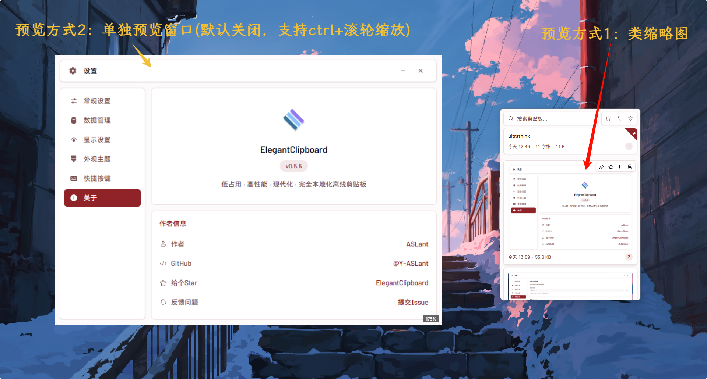
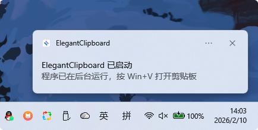

# ElegantClipboard

<p align="center">
  
</p>
<p align="center">
  低占用 · 高性能 · 现代化 · 完全本地化离线剪贴板。
</p>


<p align="center">
  <a href="https://github.com/Y-ASLant/ElegantClipboard/releases"></a>
  
  
  <a href="https://github.com/Y-ASLant/ElegantClipboard/actions/workflows/ci.yml"></a>
</p>

## 效果预览

### 外观主题

#### 跟随系统强调色


| 经典黑白 | 翡翠绿 | 天空青 |
|:-:|:-:|:-:|
|  |  |  |

#### 暗色模式

自动跟随系统深色/浅色模式，实时切换

### 设置界面

| 数据管理 | 显示设置 | 快捷按键 |
|:-:|:-:|:-:|
|  |  |  |

### 图片预览



### 启动通知



## 设计理念

**低占用 · 高性能 · 现代化 · 完全本地化离线**

- **低占用** - 托盘常驻，不打扰核心工作流，窗口不抢占焦点，仅可见时启用监控
- **高性能** - 优化的 LIKE 搜索（兼容 CJK 文本、长文本搜索）、虚拟列表处理万级记录、异步图像处理、内容哈希去重、关键词高亮显示
- **现代化** - Tauri 2.0 + React 19 + Tailwind CSS 4，类型安全，优雅架构
- **本地化离线** - 数据完全本地存储，无网络请求，无云同步，隐私至上

## 功能特性

### 剪贴板管理
- **多类型支持** - 文本、图片、文件、HTML、RTF 五种内容类型
- **无限历史记录** - 自动记录所有复制内容，随时回溯
- **智能搜索** - 实时搜索历史记录，优化的 LIKE 查询（专为中文等 CJK 文本优化）
- **内容去重** - BLAKE3 哈希自动去重，相同内容不重复存储
- **置顶/收藏** - 重要内容可置顶或收藏，不受自动清理影响
- **拖拽排序** - 卡片支持拖拽排序，跨置顶/普通区域拖拽自动切换状态
- **点击即粘贴** - 点击记录直接粘贴到活动窗口
- **纯文本粘贴** - 支持以纯文本形式粘贴（Shift+Enter 或右键菜单）
- **文本编辑** - 双击或右键编辑已保存的文本内容
- **来源应用识别** - 自动记录复制内容的来源应用名称和图标
- **去重策略** - 可选置顶/忽略/始终新建三种重复内容处理方式
- **数据导入/导出** - 支持 JSON 格式的数据导入导出，方便迁移

### 搜索优化
- **中文兼容性** - 使用优化的 LIKE 查询，完美支持中文等 CJK 文本
- **字段智能选择** - 仅在预览字段和文件路径上搜索，避免大文本字段全表扫描
- **性能平衡** - 在搜索准确性和性能之间取得最佳平衡
- **关键词高亮** - 搜索时自动提取关键词上下文，提升搜索体验

### 图片预览
- **缩略图预览** - 图片类型自动生成缩略图（Asset Protocol 零开销加载）
- **单图片文件预览** - 复制的图片文件自动显示图片预览（失败时回退为文件卡片）
- **悬浮放大预览** - 鼠标悬停 300ms 弹出独立预览窗口，支持大图查看
- **Ctrl+滚轮缩放** - 预览窗口支持平滑缩放（CSS transition 动画，零窗口 resize）
- **缩放百分比显示** - 缩放时右下角显示百分比徽章，1.2 秒后自动淡出
- **预览位置可选** - 支持自动/左侧/右侧三种预览位置偏好

### 文件管理
- **文件有效性检测** - 并行检查文件是否存在（rayon），失效文件显示红色警告
- **右键菜单** - 粘贴、粘贴为路径、在资源管理器中显示、查看详细信息
- **文件详情对话框** - 查看已复制文件的完整信息，标注失效文件

### 性能优化
- **读写分离** - 数据库连接读写分离，减少锁争用，提高并发性能
- **WAL 模式** - 启用 WAL 模式支持并发读写操作
- **内存优化** - 针对读写连接配置不同的缓存大小（写连接 64MB，读连接 32MB）
- **索引优化** - 部分索引、复合索引、降序索引等多种索引策略
- **无锁设计** - 全局鼠标监控使用原子变量，避免锁竞争
- **虚拟滚动** - 前端使用 react-virtuoso 实现高效虚拟列表，万条数据仍保持流畅

### 窗口管理
- **全局快捷键** - 自定义快捷键唤出/隐藏窗口（默认 Alt+C）
- **Win+V 替换** - 可选替换系统 Win+V（通过注册表禁用系统热键）
- **点击外部隐藏** - 全局鼠标监控，点击窗口外部自动隐藏（仅窗口可见时启用）
- **窗口固定** - 锁定窗口防止自动隐藏
- **跟随光标** - 可选在光标位置显示窗口
- **多显示器支持** - 智能定位，保持窗口在屏幕边界内
- **记住窗口大小** - 可选持久化窗口尺寸，重启后恢复（默认开启）

### 自定义设置
- **自定义存储路径** - 支持数据迁移和路径自定义
- **历史记录限制** - 可设置最大记录数（0 为无限制）
- **内容大小限制** - 单条内容最大大小可配置
- **显示设置** - 预览行数（1-10 行）、时间格式、字符数/大小/来源应用显示可选
- **卡片密度** - 紧凑/标准/宽松三种卡片间距
- **音效反馈** - 可选复制/粘贴操作音效
- **图片预览设置** - 启用/禁用悬浮预览、缩放步进（5%-50%）、预览位置偏好
- **窗口状态重置** - 窗口隐藏时自动重置搜索和滚动位置（可选）
- **开机自启** - 支持系统启动时自动运行
- **管理员启动** - 可选以管理员权限运行（UAC 提升）
- **数据库优化** - 手动触发 OPTIMIZE / VACUUM
- **数据统计** - 实时查看数据库、图片缓存大小和文件数量

### 外观主题
- **跟随系统强调色**（默认） - 自动读取 Windows 系统强调色，实时跟随变更
- **经典黑白** - 简约黑白灰配色
- **翡翠绿 / 天空青** - 预设配色方案
- **暗色模式** - 自动跟随系统深色/浅色模式

### 系统集成
- **系统托盘** - 左键切换窗口、右键菜单（设置、重启、退出）
- **非焦点窗口** - 窗口不抢占焦点，不影响当前操作
- **键盘模拟** - Windows 使用 SendInput、其他平台使用 enigo 模拟 Ctrl+V 实现粘贴
- **快速粘贴** - 支持 Alt+数字键快速粘贴对应位置的条目（可自定义）
- **启动通知** - 应用启动后显示系统通知，提示快捷键

## 快捷键

### 全局快捷键

| 快捷键 | 功能 |
|--------|------|
| `Alt+C` | 显示/隐藏窗口（默认，可自定义） |
| `Win+V` | 显示/隐藏窗口（可选，需在设置中开启） |

### 窗口内快捷键

| 快捷键 | 功能 |
|--------|------|
| `↑` / `↓` | 上下选择剪贴板条目 |
| `←` / `→` | 切换分组标签（全部/文本/图片/文件/收藏） |
| `Enter` | 粘贴选中条目 |
| `Shift+Enter` | 以纯文本粘贴选中条目 |
| `Delete` | 删除选中条目 |
| `ESC` | 关闭对话框/隐藏窗口 |
| `Ctrl+滚轮` | 缩放图片预览 |

## 技术栈

| 类别 | 技术 |
|------|------|
| **框架** | Tauri 2.0 |
| **前端** | React 19 + TypeScript |
| **构建** | Vite 7 |
| **样式** | Tailwind CSS 4 |
| **组件** | shadcn/ui (Radix UI) + Fluent UI Icons |
| **状态管理** | Zustand 5（持久化 + 多窗口同步） |
| **虚拟列表** | react-virtuoso |
| **拖拽排序** | @dnd-kit |
| **后端** | Rust |
| **数据库** | SQLite (rusqlite) + 优化的 LIKE 查询（支持 CJK 文本） |
| **哈希** | BLAKE3（内容去重） |
| **锁** | parking_lot（高性能 Mutex/RwLock） |
| **并行** | rayon（文件检查并行化） |
| **剪贴板** | clipboard-master + arboard + clipboard-rs |
| **键盘模拟** | enigo |
| **输入监控** | Win32 LL Hook（WH_MOUSE_LL + WH_KEYBOARD_LL，仅窗口可见时启用键盘钩子） |
| **CI/CD** | GitHub Actions（CI + Tag 触发 Release） |

## 安装

### 下载安装包

从 [Releases](https://github.com/Y-ASLant/ElegantClipboard/releases) 页面下载最新版本的安装包。

### winget

```powershell
winget install Y-ASLant.ElegantClipboard
```

### Scoop

```powershell
scoop bucket add elegantclipboard https://github.com/Y-ASLant/ElegantClipboard
scoop install elegantclipboard
```

### 从源码构建

#### 环境要求

- Node.js 18+（推荐 LTS 版本）
- Rust 1.80+（需要 `std::sync::LazyLock`）
- Windows 10/11

#### 构建步骤

```bash
# 克隆仓库
git clone https://github.com/Y-ASLant/ElegantClipboard.git
cd ElegantClipboard

# 安装依赖
npm install

# 仅构建前端静态资源（dist/）
npm run build

# 开发模式
npm run tauri dev

# 构建生产版本（默认仅当前机器架构）
npm run tauri build

# 分别构建 x64 / arm64 安装包（需执行两次）
npm run tauri build -- --target x86_64-pc-windows-msvc
npm run tauri build -- --target aarch64-pc-windows-msvc

# 代码检查
npm run lint
```

说明：
- `npm run build` 只会执行 `tsc && vite build`，用于前端资源构建，不会生成安装包。
- 安装包由 `npm run tauri build` 生成；不指定 `--target` 时只构建当前环境对应架构。
- 需要同时发布 `x64` 和 `arm64` 时，需分别执行两次带 `--target` 的构建命令（或在 CI 中分架构构建）。

#### 版本管理

```powershell
# 统一修改三处版本号（package.json, tauri.conf.json, Cargo.toml）
.\scripts\bump-version.ps1 0.5.0
```

或直接推送 tag，Release workflow 自动同步版本号并构建：

```bash
git tag v0.5.0
git push origin v0.5.0
```

## 数据存储

默认存储位置（可在设置中修改）：

| 类型 | 路径 |
|------|------|
| 配置文件 | `%LOCALAPPDATA%\ElegantClipboard\config.json` |
| 数据库 | `<数据目录>\clipboard.db` |
| 图片缓存 | `<数据目录>\images\` |

## 许可证

[MIT License](LICENSE)

## 作者

**ASLant** - [@Y-ASLant](https://github.com/Y-ASLant)
