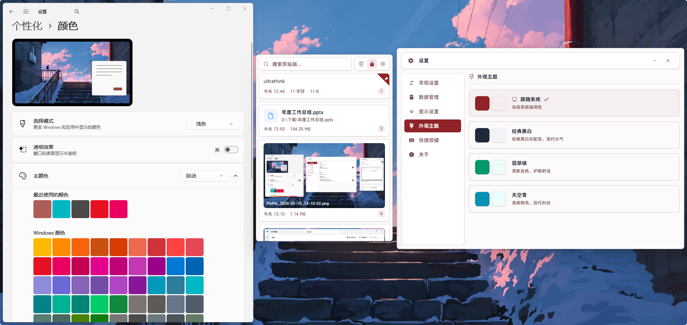
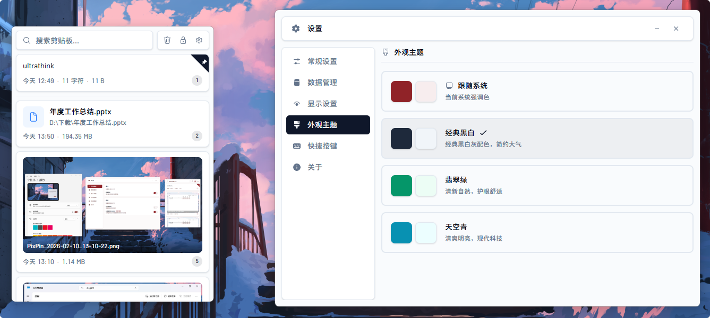
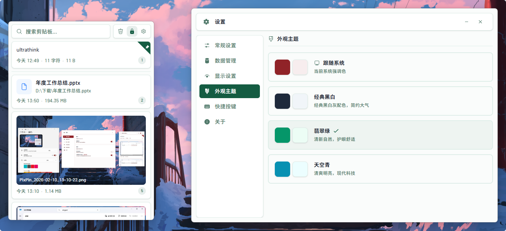
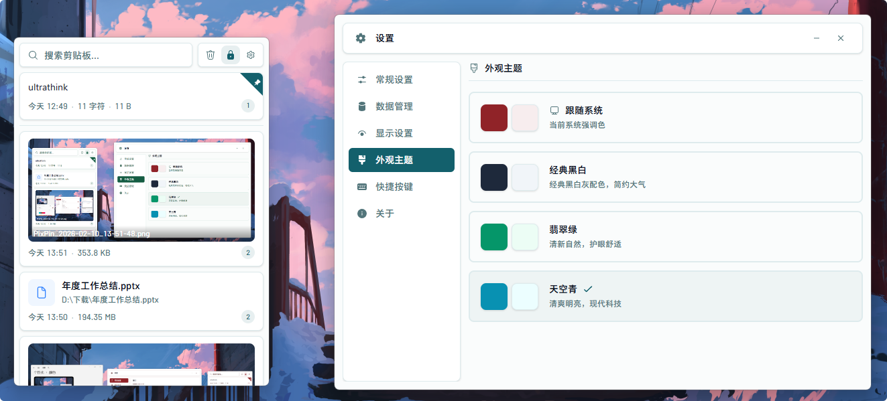
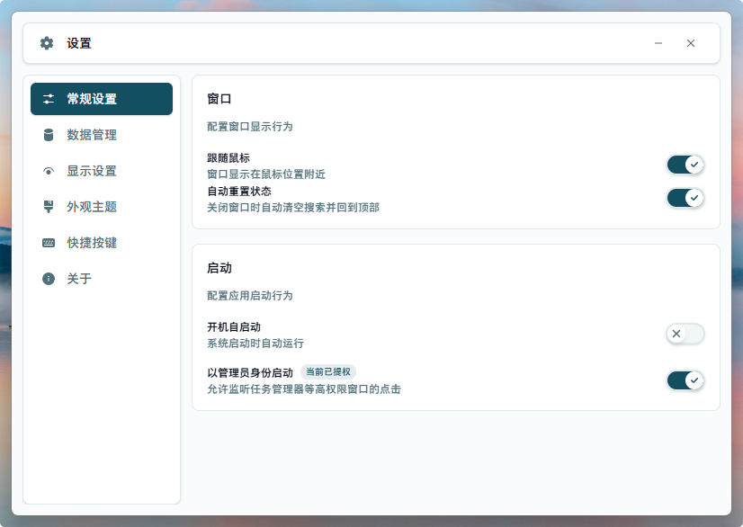
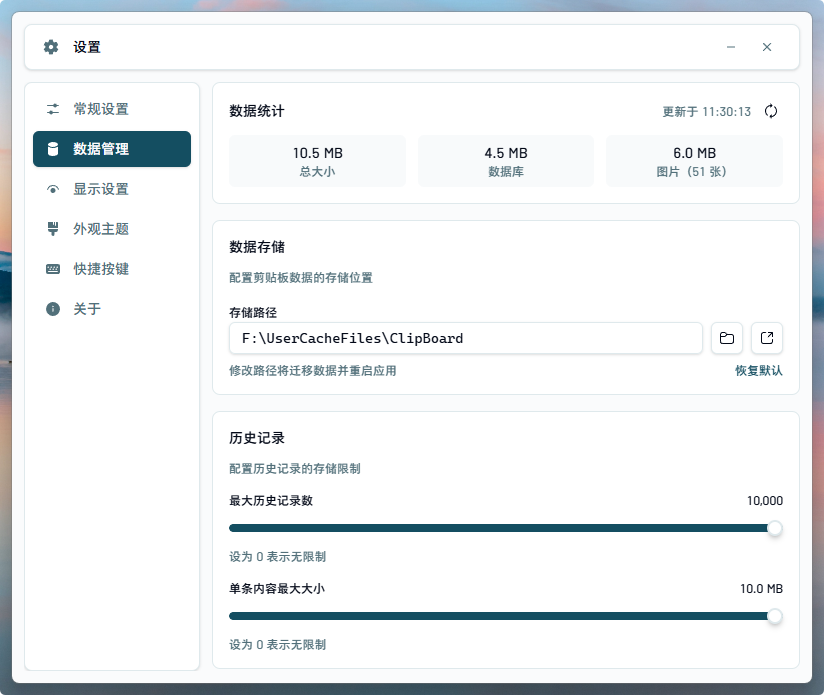
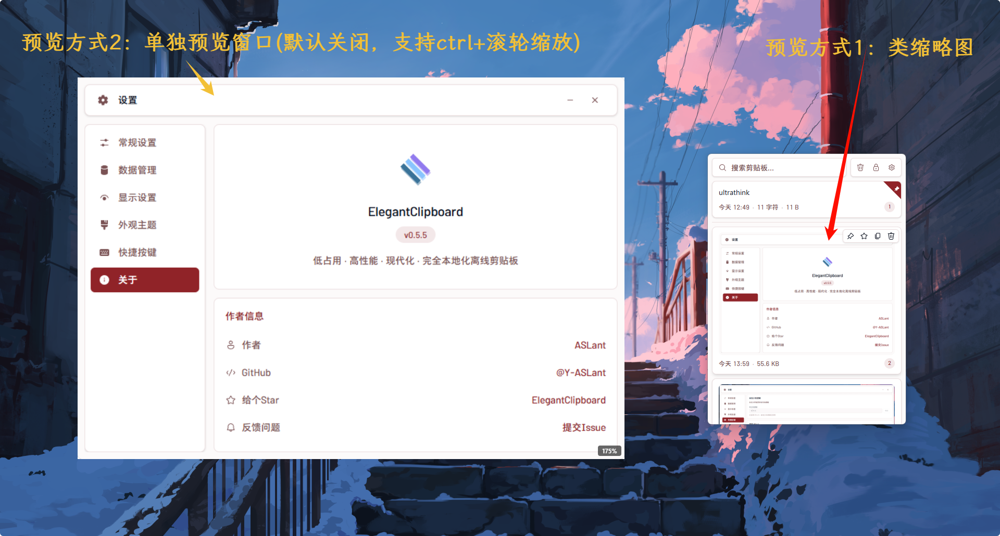
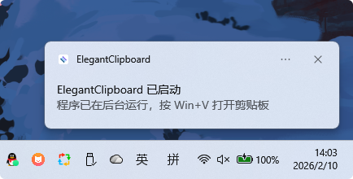

# ElegantClipboard

[English](README_EN.md) | 中文

## 版本与分支

- **`main` 分支**：现有 **1.x 版本**，采用 Tauri + React 架构。
- **[`gpui` 分支](https://github.com/Y-ASLant/ElegantClipboard/tree/gpui)**：基于 **Rust + GPUI 的全新 2.0.0 重构版本**，与现有 Tauri 版本独立开发。

本文下方的功能、截图和构建说明针对 `main` 分支。了解 2.0.0 的实现与构建方式，请前往 [`gpui` 分支](https://github.com/Y-ASLant/ElegantClipboard/tree/gpui)查看对应文档。

> 说明：本文档中的界面截图可能与最新版本略有差异，当前截图拍摄于 **v0.5.0**。

<p align="center">
  
</p>
<p align="center">
  低占用 · 高性能 · 现代化 · 本地优先的剪贴板管理工具。
</p>


<p align="center">
  <a href="https://github.com/Y-ASLant/ElegantClipboard/releases"></a>
  <a href="https://github.com/Y-ASLant/ElegantClipboard/releases"></a>
  
  
  <a href="https://github.com/Y-ASLant/ElegantClipboard/actions/workflows/ci.yml"></a>
</p>

## v1.2.9（发布准备）

本次是 Tauri + React 1.x 分支的可靠性修复版本，相比 v1.2.8：

- **操作结果可信**：复制、粘贴、合并和快捷键统一执行前检查；失败不再显示成功，取消另存为不误报，操作成功后的刷新失败单独提示。
- **资源状态更稳定**：区分资源缺失与预览失败；窗口显示、右键菜单和虚拟滚动重新挂载时复查，最多记住 512 个资源来源的结果，保留旧标签直至检查完成，避免「已失效」反复闪烁。复查期间仍禁用相关资源操作。
- **文件操作更安全**：另存为与资源管理器定位按条目 ID 重新解析当前资源，不信任卡片缓存的旧路径；已有文件不会因不支持的剪贴板载荷而无法保存或定位。
- **图片与错误处理修复**：修复 DIB V4/V5 解码，明确报告剪贴板访问失败，并在写入前拒绝 Windows 不支持的零字节原始格式；用户错误提示支持三语，内部诊断不直接展示。
- **GPUI 2.0 入口**：设置 → 关于软件可打开独立的 [GPUI 重构分支](https://github.com/Y-ASLant/ElegantClipboard/tree/gpui)，本次更新不切换到 GPUI。

完整变更见 [v1.2.9 更新日志](docs/Changlog.md#v129)。发布准备不代表安装包已经发布；可下载版本以 [Releases](https://github.com/Y-ASLant/ElegantClipboard/releases) 为准。

## 界面截图（v0.5.0）

### 外观主题

#### 跟随系统强调色



| 经典黑白 | 翡翠绿 | 天空青 |
|:-:|:-:|:-:|
|  |  |  |

#### 暗色模式

自动跟随系统深色/浅色模式，实时切换

### 设置界面

| 数据管理 | 显示设置 | 快捷按键 |
|:-:|:-:|:-:|
|  |  |  |

### 图片悬浮预览



### 文本悬浮预览

文本悬浮预览与图片悬浮预览共用预览位置与悬浮预览延时设置（当前默认 128ms，图片与文本预览均默认开启）。

### 启动通知



## 设计理念

**低占用 · 高性能 · 现代化 · 隐私优先**

- **低占用** - 托盘常驻，主窗口默认不抢占焦点；点击外部检测与键盘导航按窗口状态处理，剪贴板记录在后台持续运行（可手动暂停）
- **高性能** - LIKE 子串搜索（支持 CJK 文本）、虚拟列表、后台图片文件写入、内容哈希去重
- **现代化** - Tauri 2 + React 19 + Tailwind CSS 4，TypeScript 与 Rust
- **隐私优先** - 历史数据默认本地存储；WebDAV 同步和在线翻译为可选功能，更新检查默认开启且可关闭
- **多语言界面** - 简体中文 / English / 繁體中文，设置中切换，多窗口实时同步

## 功能特性

完整功能列表与术语约定见 [FEATURES.md](FEATURES.md)。

文件历史保存复制时的原始路径，并可能保存可用的暂存副本（staged fallback）。原文件移动或删除后，仅在暂存副本仍可用时才可回退，并非所有文件都能恢复。可见文件与缓存图片卡片统一刷新资源可用性，区分未知、检查中、可用和不可用，并分别判断剪贴板载荷是否可用。资源缺失显示“已失效”；不支持的伴生格式不会把仍存在的物理文件标成缺失，但会禁用复制/粘贴。图片加载错误只显示“预览加载失败”，不会把存在的文件误判为失效；预览大小限制也不影响存在性检查。可用性不等于实际可读取或可解码，执行时还会检查所需内容；可读取的原文件即使预览失败或伴生格式不受支持，也可另存为原始字节或在资源管理器中定位。另存为和资源管理器定位会按当前条目重新解析原始/暂存路径，而不是使用卡片中的旧路径。详见 [文件管理](FEATURES.md#文件管理)。

复制/粘贴的卡片、菜单、键盘、全局快速/收藏/重复快捷键、合并及翻译入口共用后端执行前检查；检查失败不改写现有剪贴板或隐藏主窗口。只有后端成功才触发成功反馈和操作后的选择/排序更新；取消另存为不提示成功或错误，后续列表刷新失败则单独提示。操作错误使用本地化的安全原因，原始诊断只记入日志。粘贴成功表示剪贴板写入和按键模拟成功，不保证目标应用已接收内容。详见 [操作检查与反馈](FEATURES.md#操作检查与反馈)。

## 快捷键

### 全局快捷键

| 快捷键 | 功能 |
|--------|------|
| `Alt+C` | 显示/隐藏窗口（默认，可自定义） |
| `Win+V` | 显示/隐藏窗口（可选，需在设置中开启） |

### 窗口内快捷键

上下选择、分类切换、Enter/Shift+Enter 和 Delete 需先在设置 → 快捷按键开启键盘导航（默认关闭）；分类切换还需显示分类筛选栏。

| 快捷键 | 功能 |
|--------|------|
| `↑` / `↓` | 上下选择剪贴板条目 |
| `←` / `→` | 切换内容分类（全部 / 文本 / 其它），不是自定义分组 |
| `Enter` | 粘贴选中条目 |
| `Shift+Enter` | 以纯文本粘贴选中条目 |
| `Delete` | 删除选中条目 |
| `ESC` | 关闭对话框/隐藏窗口 |
| `Ctrl+滚轮` | 在主窗口中缩放图片悬浮预览 / 滚动文本悬浮预览 |

## 技术栈

| 类别 | 技术 |
|------|------|
| **框架** | Tauri 2 |
| **前端** | React 19 + TypeScript |
| **构建** | Vite 8 |
| **样式** | Tailwind CSS 4 |
| **组件** | shadcn/ui (Radix UI) + Fluent UI Icons |
| **状态管理** | Zustand 5（设置通过后端数据库持久化 + 多窗口事件同步） |
| **虚拟列表** | react-virtuoso |
| **拖拽排序** | @dnd-kit |
| **后端** | Rust |
| **数据库** | SQLite (rusqlite) + 优化的 LIKE 查询（支持 CJK 文本） |
| **哈希** | BLAKE3（内容去重） |
| **锁** | parking_lot（高性能 Mutex/RwLock） |
| **并行** | rayon（文件检查并行化） |
| **剪贴板** | clipboard-rs 0.3.5 本地分叉（文本 / HTML / RTF / 图片 / 文件 / 监听） |
| **窗口特效** | window-vibrancy（Mica/Acrylic/Tabbed） |
| **键盘模拟** | Windows SendInput（Ctrl+V / Shift+Insert） |
| **输入监控** | Win32 LL Hook（鼠标点击外部检测 + 可见主窗口的键盘处理，与后台剪贴板监听独立） |
| **自动更新** | 基于 GitHub Release 的检查与下载（支持系统代理） |
| **CI/CD** | GitHub Actions（CI + Tag 触发 Release） |
| **检查与测试** | ESLint 10 + eslint-plugin-import-x、TypeScript 6、Vitest 4、Playwright |

## 安装

### 下载安装包

从 [Releases](https://github.com/Y-ASLant/ElegantClipboard/releases) 页面下载最新版本：

- **安装版**（推荐）：`ElegantClipboard_x.x.x_<架构>-setup.exe`
- **便携版**：`ElegantClipboard_x.x.x_<架构>_portable.exe`（无需安装，直接运行）

Release 工作流分别构建 x64 和 arm64；请选择与设备匹配的下载文件。运行界面需要 Microsoft Edge WebView2 Runtime，安装包包含其引导安装程序，便携版需已有该运行时。

### winget

```powershell
winget install Y-ASLant.ElegantClipboard
```

### Scoop

```powershell
scoop bucket add elegantclipboard https://github.com/Y-ASLant/ElegantClipboard
scoop install elegantclipboard
```

### 从源码构建

#### 环境要求

- Node.js 20.19+（20.x）、22.13+（22.x）或 24+，推荐当前 LTS（以依赖的 engines 要求为准）
- 当前稳定版 Rust（edition 2024）及对应 Windows MSVC 工具链
- Windows 10/11、Microsoft C++ Build Tools 与 WebView2 Runtime
- PowerShell；使用 `make` 命令还需安装 GNU Make

Rust 的 `*-pc-windows-msvc` 目标需要 **MSVC x64/x86 编译与链接工具**和 **Windows SDK**；只有 Rust、VS Code 或 WebView2 不够。若提示 `link.exe not found`，可用微软 Build Tools 安装器选择这两个组件，或执行：

```powershell
winget install --id Microsoft.VisualStudio.2022.BuildTools --exact --source winget --override "--add Microsoft.VisualStudio.Component.VC.Tools.x86.x64 --add Microsoft.VisualStudio.Component.Windows11SDK.26100 --passive --wait --norestart"
```

安装需要管理员授权。安装完成后重新打开终端；若普通 PowerShell 仍未加载编译环境，从开始菜单打开 **x64 Native Tools Command Prompt for VS 2022**，切到项目目录后再执行构建。该环境同时配置编译器、链接器、头文件和 SDK 库路径，不要仅把某个 `link.exe` 文件加入 PATH。组件信息见 [微软 Build Tools 文档](https://learn.microsoft.com/en-us/visualstudio/install/workload-component-id-vs-build-tools?view=vs-2022)。

#### 构建步骤

```bash
# 克隆仓库
git clone https://github.com/Y-ASLant/ElegantClipboard.git
cd ElegantClipboard

# 安装依赖
npm install

# 仅构建前端静态资源（dist/）
npm run build

# 开发模式
npm run tauri dev

# 构建生产版本（默认仅当前机器架构）
npm run tauri build

# 跨架构构建前安装对应 Rust target，并准备该架构的 MSVC 编译/链接工具
rustup target add x86_64-pc-windows-msvc aarch64-pc-windows-msvc

# 分别构建 x64 / arm64 安装包（需执行两次）
npm run tauri build -- --target x86_64-pc-windows-msvc
npm run tauri build -- --target aarch64-pc-windows-msvc

# 前端类型与零警告代码检查（含测试、配置及 e2e）
npm run typecheck
npm run lint

# 完整质量门禁 / 格式修复（Makefile 使用 PowerShell）
make check
make format

# 前端、应用 Rust 和剪贴板分叉纯测试（默认 / 无默认特性）
make test
# 或分别执行：
npm test
cargo test --manifest-path src-tauri/Cargo.toml --all-targets
cargo test --manifest-path clipboard-rs/Cargo.toml --all-targets
cargo test --manifest-path clipboard-rs/Cargo.toml --all-targets --no-default-features

# 性能基准 / 前端端到端测试（单独运行）
npm run bench
npx playwright install chromium
npm run test:e2e
```

说明：
- `npm run build` 只会执行 `tsc && vite build`，用于前端资源构建，不会生成安装包。
- 安装包由 `npm run tauri build` 生成；不指定 `--target` 时只构建当前环境对应架构。
- 需要同时发布 `x64` 和 `arm64` 时，需分别执行两次带 `--target` 的构建命令（或在 CI 中分架构构建）。
- `npm run typecheck` 检查应用、测试、构建配置和 e2e 的 TypeScript；`npm run lint` 同样覆盖这些范围并以 `--max-warnings=0` 拒绝警告。前端构建不能替代完整类型检查。
- `make check` 包含前端类型/ESLint、应用及剪贴板分叉的 Rustfmt 检查、应用的 `cargo check --all-targets`，以及应用和分叉的 `cargo clippy --all-targets -- -D warnings`；分叉还执行 `--no-default-features` Clippy。`make format` 使用 `cargo fmt` 格式化应用与分叉，并执行前端自动修复；使用当前 Rust 工具链，不依赖写死的 rustup 工具链路径。
- `make test` 运行前端、应用 Rust 和剪贴板分叉默认/`--no-default-features` 的纯测试。分叉涉及系统剪贴板或桌面会话的测试默认忽略；仅在准备好独占剪贴板的真实桌面环境后，显式执行 `cargo test --manifest-path clipboard-rs/Cargo.toml --all-targets -- --ignored --test-threads=1`（会读写系统剪贴板，不属于默认质量检查）。
- `npm run test:e2e` 使用 Chromium、Vite 开发服务器及明确的 Tauri IPC 测试夹具运行实际前端应用，检查待完成/拒绝/取消操作与反馈；不靠过滤“缺少 Tauri”错误通过。它不启动原生桌面，不验证真实剪贴板、系统对话框、全局钩子、目标应用接收粘贴或其他平台运行效果；这些需要单独的原生桌面验证。

#### 版本管理

```powershell
# 统一修改三处版本号（package.json, tauri.conf.json, Cargo.toml）
.\scripts\bump-version.ps1 1.2.9
```

也可以不预先修改本地版本号：确认要发布的改动已提交后，推送 tag，Release workflow 会在构建工作区自动同步版本号并构建：

```bash
git tag v1.2.9
git push origin v1.2.9
```

发布前执行 `make check`、`make test`、`make build`，并在原生 Windows 桌面验证复制/粘贴、两种粘贴按键、失效文件复查、另存为取消与从上一版本升级。若本地验收安装包需要显示 `1.2.9`，先运行上面的版本脚本再构建；不要把开发占位版本的包作为正式包上传。

工作流创建的是 **Release 草稿**，正文不会自动读取更新日志。待 x64 / arm64 安装版和便携版产物齐全后，将 [v1.2.9 更新日志](docs/Changlog.md#v129)中的本版内容填入草稿，核对版本与产物，完成验收后再发布，并把日志中的「待发布」改为实际发布日期。GPUI 2.0 不是本次 1.2.9 的安装包或自动更新目标。

## 数据存储

默认数据目录为**可执行文件所在目录**；可在设置 → 数据管理 → 数据存储位置选择其他目录，迁移或路径切换后重启生效。

| 类型 | 路径 |
|---|---|
| 启动配置（固定位置） | `<可执行文件目录>\config.json` |
| 数据库 | `<数据目录>\clipboard.db` |
| 图片缓存 | `<数据目录>\images\` |
| 来源应用图标 | `<数据目录>\icons\` |
| 文件暂存副本（并非所有文件都有） | `<数据目录>\staged\` |
| 文件日志（可关闭） | `<数据目录>\app.log` |

安装版采用当前用户安装模式；是否需要管理员写入权限取决于所选目录的 Windows 权限，并非安装版一律需要管理员。便携模式通过 exe 同级目录是否存在 `uninstall.exe` 判断。安装版和便携版均需保证配置文件所在目录及所选数据目录可写。

ZIP 备份与数据迁移包含数据库和应用托管的图片、图标、暂存文件；普通文件历史中的原始路径不会因此变成完整文件备份。

## 许可证

[MIT License](LICENSE)
